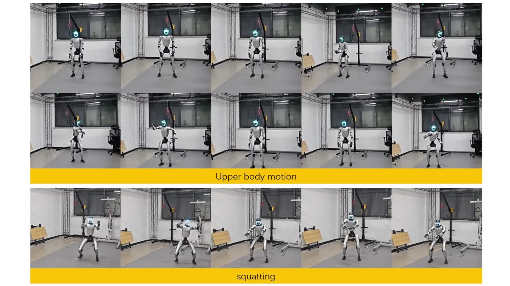
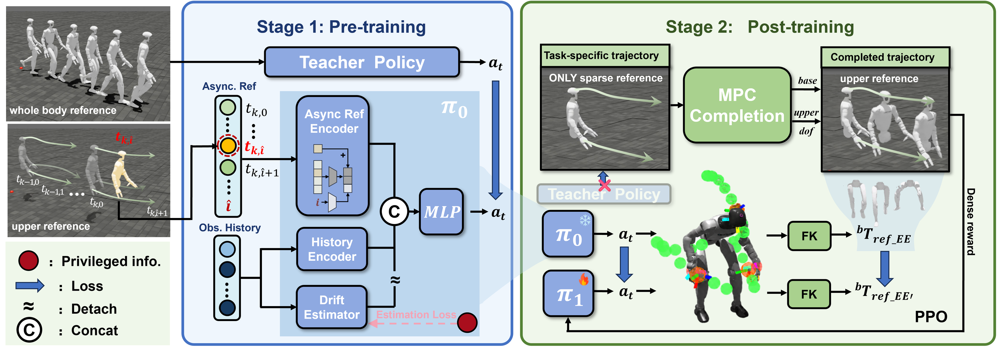
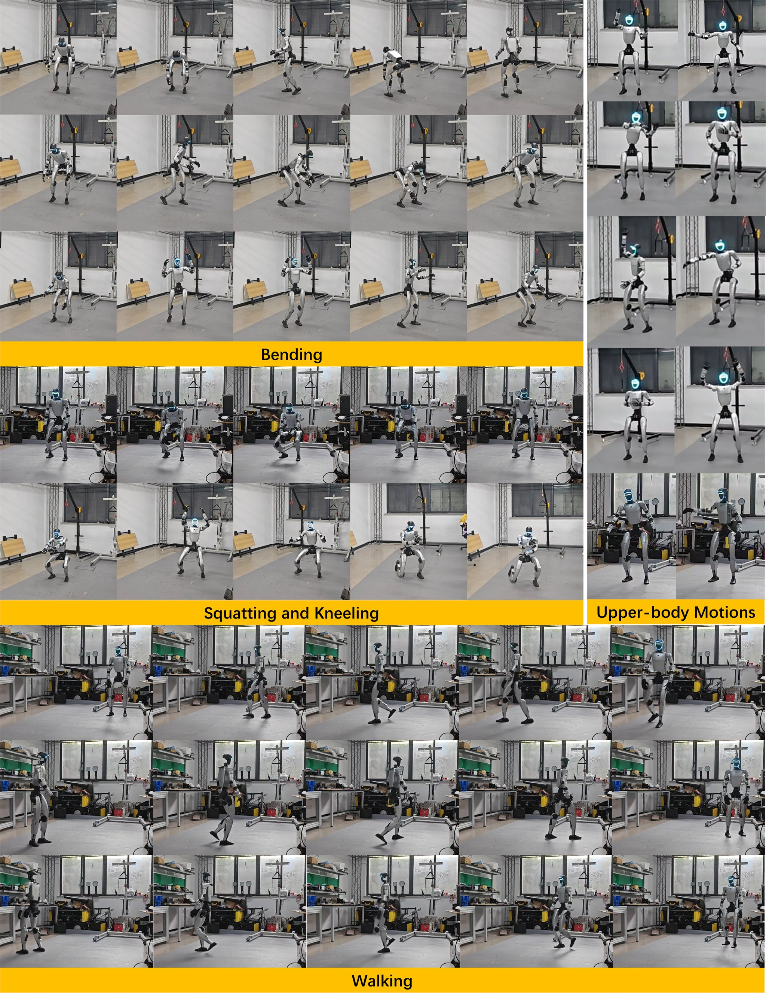

# 三点控制器

### Learning Asynchronous Upper-body Task-space Trajectory Tracking Policy for Humanoid Robots

**从头部与双手的稀疏轨迹，到人形机器人的全身运动。**

面向低频规划、高频执行的人形机器人控制研究，在仿真与 Unitree G1 实机上验证异步上半身任务空间轨迹跟踪。

> **Public project showcase.** 论文、图片和演示视频现已公开；研究实现代码、模型权重和完整数据暂未发布。

[方法概览](#方法概览) · [实验结果](#实验结果) · [实机展示](#实机展示) · [演示视频](https://anonnyyy.github.io/projects/three-point-controller/#video)

[论文 PDF](https://anonnyyy.github.io/projects/three-point-controller/paper/paper.pdf) · [完整项目网页](https://anonnyyy.github.io/projects/three-point-controller/) · [素材与结果来源](SOURCE_NOTES.md)

下载仓库后使用浏览器打开 `index.html`，可查看论文项目页、播放带章节跳转的视频并放大原图。在线浏览：https://anonnyyy.github.io/projects/three-point-controller/

## 研究问题

上层规划器只给出头部和双手的轨迹，而且更新速度低于底层控制器。机器人需要在相邻规划更新之间持续执行，同时从稀疏目标中协调稳定的全身运动。

本项目关注两个问题：**规划与执行的时间异步**，以及**三点参考对全身运动描述的不完整性**。

## 方法概览

1. **异步参考跟踪。** 通过教师–学生蒸馏初始化策略，以缓存的未来轨迹和执行时间索引作为条件，在两次参考更新之间持续执行。
2. **滑动窗口全局奖励。** 学习应对异步更新带来的规划坐标系偏差；漂移估计不用于在线修正参考。
3. **MPC 轨迹补全。** 在面向任务的后训练中，将稀疏目标补全为浮动基座和上半身指导。
4. **自引导约束。** 在动作和正向运动学层面限制策略漂移，兼顾任务适应、鲁棒性与运动平滑性。

## 实验结果

下列结果来自当前修订稿，保留各自的评测范围。

| 评测范围 | 结果 | 含义 |
| :--- | :--- | :--- |
| G1 实机，14 类动作，每类 5 次 | **60 / 70** | 无跌倒完成试验 |
| 按零样本仿真成功筛选的 5 类动作，后训练后 | **25 / 25** | 该匹配硬件子集上的成功次数 |
| 相同 5 类动作，移除自引导 | **21 / 25** | 自引导消融对照 |

在该 5 类动作的匹配子集上，移除自引导后，上半身关节加速度指标从 **9.476** 增至 **14.008 rad/s²**。该指标为 17 个实测上半身关节的逐时刻 RMS 加速度的时间平均，数值越低表示运动越平滑。

## 实机展示

Unitree G1 实验涵盖行走、弯腰与下蹲、跪地、起身及操作任务。上图展示其中部分动作。

## 演示视频

[观看或下载项目演示（MP4）](https://anonnyyy.github.io/projects/three-point-controller/#video)

视频已随项目展示仓库公开，可直接查看或下载。

## 资料范围

此仓库包含项目介绍、方法框图、实机实验图及演示视频。训练代码、模型权重和完整原始数据不包含在当前展示版本中。

研究实现代码暂未发布；此仓库为论文与演示资料展示，不是可运行的研究代码库。
